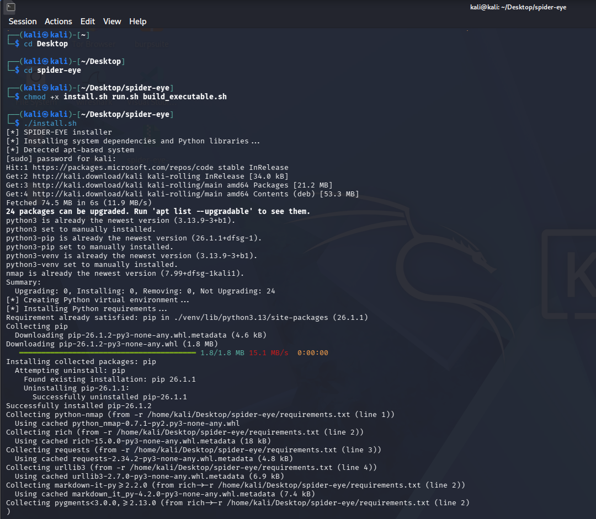
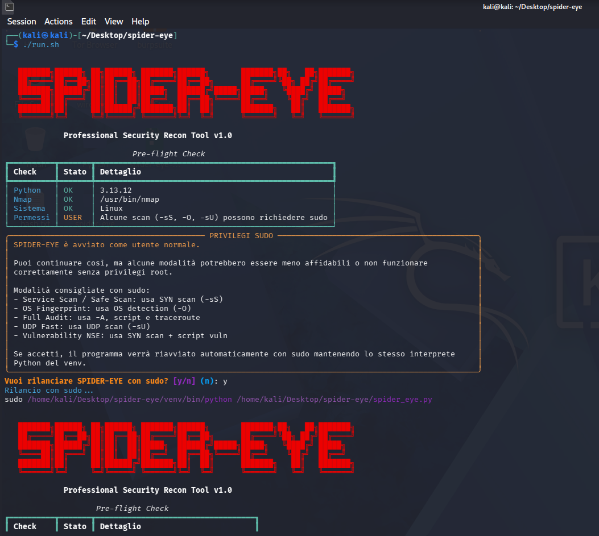
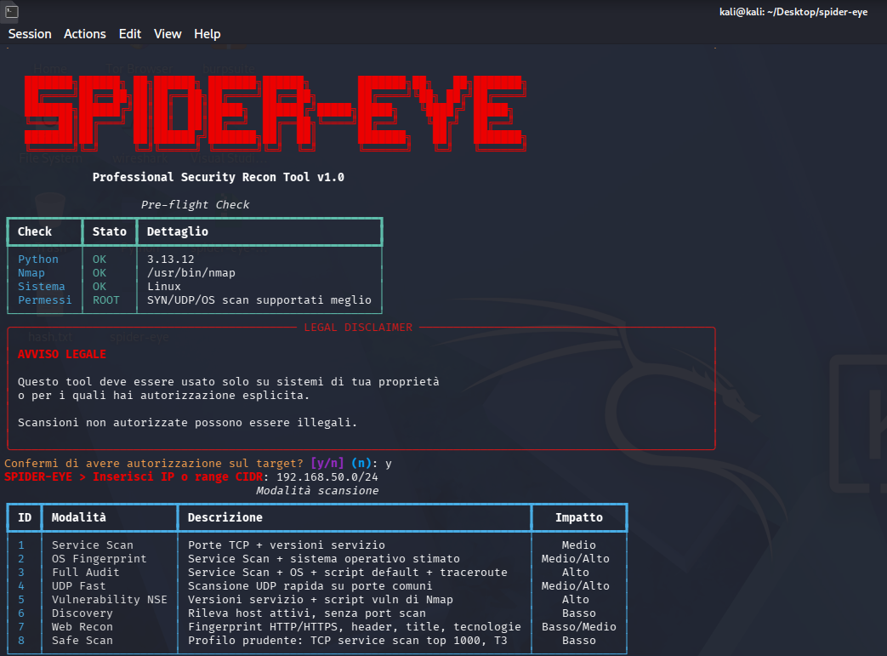
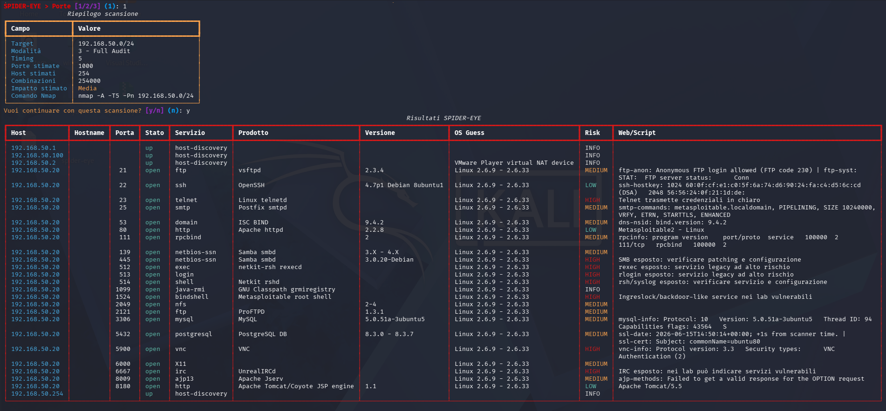

# SPIDER-EYE

**Tool di ricognizione e auditing di rete basato su Nmap**

SPIDER-EYE è un tool sviluppato in Python per automatizzare attività di network reconnaissance, enumeration e auditing di rete in ambienti autorizzati.

Il progetto utilizza **Nmap** come motore principale e aggiunge un'interfaccia testuale guidata, report automatici, classificazione del rischio, Web Recon, scansioni NSE e gestione facilitata dei privilegi sudo.

> Progetto pensato per scopi dimostrativi, didattici, CTF, laboratori di cybersecurity e portfolio personale.

---

## Disclaimer legale

SPIDER-EYE deve essere utilizzato esclusivamente su:

* sistemi di propria proprietà;
* ambienti di laboratorio;
* macchine vulnerabili da training;
* CTF;
* reti interne autorizzate;
* target per cui si possiede autorizzazione esplicita.

L'utilizzo non autorizzato contro sistemi di terze parti può essere illegale.

Gli autori non sono responsabili per usi impropri, danni, interruzioni di servizio o conseguenze legali causate dall'utilizzo del tool.

---

## Obiettivo del progetto

Nmap è uno degli strumenti più potenti per la ricognizione di rete, ma richiede conoscenza dei parametri, delle modalità di scansione e dell'interpretazione dei risultati.

SPIDER-EYE nasce per semplificare questo processo attraverso:

* menu interattivi;
* profili di scansione preconfigurati;
* output leggibile da terminale;
* report automatici;
* classificazione del rischio;
* Web Recon;
* modalità CLI;
* rilancio automatico con sudo;
* esportazione dei risultati.

Il tool non sostituisce Nmap, ma lo rende più accessibile e organizzato.

---

## Screenshot

Le immagini devono essere salvate nella cartella `screenshots/` con questi nomi:

```text
screenshots/
├── 01-installazione.png
├── 02-avvio-sudo.png
├── 03-menu-modalita.png
└── 04-risultati-full-audit.png
```

### Installazione

Questa schermata mostra l'esecuzione dello script `install.sh`, la creazione del virtual environment e l'installazione delle dipendenze.



---

### Avvio e rilancio con sudo

Questa schermata mostra il controllo iniziale dell'ambiente e la richiesta di rilancio automatico con privilegi sudo.



---

### Menu delle modalità di scansione

Questa schermata mostra il disclaimer legale, l'inserimento del target e il menu principale delle modalità disponibili.



---

### Esempio risultati Full Audit

Questa schermata mostra un esempio reale di output prodotto dalla modalità Full Audit in ambiente di laboratorio.



---

## Funzionalità principali

| Funzionalità      | Descrizione                                               |
| ----------------- | --------------------------------------------------------- |
| Host Discovery    | Rileva host attivi in una rete                            |
| Service Scan      | Identifica porte TCP aperte, servizi e versioni           |
| OS Fingerprint    | Stima il sistema operativo del target                     |
| Full Audit        | Esegue una scansione completa con script NSE default      |
| UDP Fast          | Scansiona porte UDP comuni o personalizzate               |
| Vulnerability NSE | Esegue script NSE orientati alle vulnerabilità            |
| Web Recon         | Analizza servizi HTTP/HTTPS                               |
| Safe Scan         | Profilo prudente con Top 1000 porte e timing T3           |
| Risk Rating       | Classifica automaticamente il rischio dei servizi esposti |
| Auto Sudo         | Permette il rilancio automatico con privilegi root        |
| Report            | Esporta risultati in JSON, CSV, HTML e Markdown           |
| CLI Mode          | Permette l'utilizzo diretto da terminale                  |

---

## Come funziona

SPIDER-EYE segue un workflow guidato:

```text
Target
  |
  v
Selezione modalità di scansione
  |
  v
Costruzione comando Nmap
  |
  v
Esecuzione scansione
  |
  v
Parsing dei risultati
  |
  v
Web Recon / NSE Output / OS Guess
  |
  v
Risk Rating
  |
  v
Generazione report
```

Il programma costruisce automaticamente il comando Nmap corretto in base alla modalità scelta, esegue la scansione, interpreta i risultati e genera report leggibili.

---

## Modalità di scansione

SPIDER-EYE include 8 modalità principali.

| ID | Modalità          | Descrizione                                         | Impatto     |
| -: | ----------------- | --------------------------------------------------- | ----------- |
|  1 | Service Scan      | Porte TCP, servizi e versioni                       | Medio       |
|  2 | OS Fingerprint    | Service Scan + sistema operativo stimato            | Medio/Alto  |
|  3 | Full Audit        | Service Scan + OS + script NSE default + traceroute | Alto        |
|  4 | UDP Fast          | Scansione UDP su porte comuni o custom              | Medio/Alto  |
|  5 | Vulnerability NSE | Script NSE di Nmap orientati alle vulnerabilità     | Alto        |
|  6 | Discovery         | Rileva host attivi senza port scan                  | Basso       |
|  7 | Web Recon         | Fingerprint HTTP/HTTPS, header, title e tecnologie  | Basso/Medio |
|  8 | Safe Scan         | Profilo prudente con Top 1000 porte e T3            | Basso       |

---

## Dettaglio modalità

### 1. Service Scan

La modalità Service Scan serve per ottenere una prima panoramica dei servizi esposti.

Rileva:

* porte TCP aperte;
* nome del servizio;
* prodotto;
* versione;
* informazioni extra restituite da Nmap.

Comando Nmap equivalente:

```bash
nmap -sS -sV -Pn <target>
```

---

### 2. OS Fingerprint

La modalità OS Fingerprint aggiunge il rilevamento del sistema operativo.

Rileva:

* porte e servizi;
* versioni;
* possibile sistema operativo;
* accuratezza del fingerprint quando disponibile.

Comando Nmap equivalente:

```bash
nmap -sS -sV -O -Pn <target>
```

---

### 3. Full Audit

La modalità Full Audit è la scansione generale più completa.

Include:

* service detection;
* version detection;
* OS detection;
* script NSE default;
* traceroute quando disponibile.

Comando Nmap equivalente:

```bash
nmap -A -Pn <target>
```

Questa modalità è consigliata in ambienti lab o assessment autorizzati.

---

### 4. UDP Fast

La modalità UDP Fast esegue scansioni su porte UDP.

UDP è più ambiguo rispetto a TCP perché non esiste handshake.

Possibili stati UDP:

```text
open
closed
open|filtered
```

Servizi UDP comuni:

```text
53    DNS
69    TFTP
111   RPCBind
123   NTP
137   NetBIOS
138   NetBIOS
161   SNMP
2049  NFS
```

Per UDP è consigliato l'utilizzo con `sudo`.

---

### 5. Vulnerability NSE

Questa modalità esegue gli script NSE di Nmap orientati alla ricerca di vulnerabilità.

Comando Nmap equivalente:

```bash
nmap -sS -sV --script vuln -Pn <target>
```

Può evidenziare:

* CVE note;
* servizi vulnerabili;
* configurazioni deboli;
* versioni obsolete;
* output NSE rilevanti.

Questa modalità può essere rumorosa e deve essere usata solo su target autorizzati.

---

### 6. Discovery

Discovery rileva host attivi senza eseguire un port scan completo.

Comando Nmap equivalente:

```bash
nmap -sn <target>
```

Esempio:

```bash
spider-eye -t 192.168.50.0/24 -m discovery
```

---

### 7. Web Recon

Web Recon analizza servizi HTTP e HTTPS.

Raccoglie:

* URL;
* status code;
* titolo pagina;
* header Server;
* header X-Powered-By;
* redirect;
* tecnologie base;
* informazioni SSL quando disponibili.

Esempio:

```bash
spider-eye -t 192.168.50.20 -m web -p web
```

---

### 8. Safe Scan

Safe Scan è il profilo più prudente.

Usa sempre:

```bash
nmap -sS -sV --top-ports 1000 -T3 -Pn <target>
```

Caratteristiche:

* timing fisso T3;
* Top 1000 porte Nmap;
* basso impatto;
* adatto a dimostrazioni e test rapidi.

---

## Sistema di Risk Rating

SPIDER-EYE assegna automaticamente un livello di rischio ai risultati.

| Livello  | Significato                                           |
| -------- | ----------------------------------------------------- |
| INFO     | Informazione utile ma non necessariamente rischiosa   |
| LOW      | Servizio esposto a basso rischio                      |
| MEDIUM   | Servizio da verificare con attenzione                 |
| HIGH     | Servizio potenzialmente pericoloso o sensibile        |
| CRITICAL | Output NSE con possibile vulnerabilità, CVE o exploit |

Esempi:

| Porta/Servizio  | Rischio | Motivazione                                   |
| --------------- | ------- | --------------------------------------------- |
| 22/SSH          | LOW     | Servizio di amministrazione remota            |
| 21/FTP          | MEDIUM  | Possibile trasmissione dati in chiaro         |
| 23/Telnet       | HIGH    | Credenziali in chiaro                         |
| 445/SMB         | HIGH    | Servizio sensibile frequentemente bersagliato |
| 5900/VNC        | HIGH    | Desktop remoto esposto                        |
| 3306/MySQL      | MEDIUM  | Database accessibile in rete                  |
| 5432/PostgreSQL | MEDIUM  | Database accessibile in rete                  |
| 6667/IRC        | HIGH    | Servizio legacy o potenzialmente rischioso    |

---

## Report generati

Dopo ogni scansione, SPIDER-EYE crea automaticamente i report nella cartella:

```text
spider_reports/
```

Formati generati:

```text
.json
.csv
.html
.md
```

I report includono:

* target;
* modalità usata;
* timing;
* comando Nmap equivalente;
* host rilevati;
* porte aperte;
* protocollo;
* stato;
* servizio;
* prodotto;
* versione;
* OS Guess;
* OS Accuracy;
* output NSE;
* dati Web Recon;
* risk level;
* risk note.

---

## Installazione

Clona il repository:

```bash
git clone https://github.com/xMike-hub/spider-eye.git
cd spider-eye
```

Assegna i permessi agli script:

```bash
chmod +x install.sh
chmod +x run.sh
chmod +x build_executable.sh
```

Esegui l'installer:

```bash
./install.sh
```

Al termine:

```bash
spider-eye
```

---

## Requisiti

Dipendenze di sistema:

```text
Python 3
pip
venv
Nmap
```

Librerie Python:

```text
python-nmap
rich
requests
urllib3
```

---

## Utilizzo

Modalità interattiva:

```bash
spider-eye
```

Oppure dalla cartella del progetto:

```bash
./run.sh
```

Service Scan:

```bash
spider-eye -t 192.168.50.20 -m service -p top1000
```

OS Fingerprint:

```bash
spider-eye -t 192.168.50.20 -m os -p top1000
```

Full Audit:

```bash
spider-eye -t 192.168.50.20 -m full-audit -p top1000
```

Discovery:

```bash
spider-eye -t 192.168.50.0/24 -m discovery
```

Web Recon:

```bash
spider-eye -t 192.168.50.20 -m web -p web
```

UDP Scan:

```bash
sudo spider-eye -t 192.168.50.20 -m udp -p 53,111,137,138,2049 -y
```

Vulnerability NSE:

```bash
sudo spider-eye -t 192.168.50.20 -m vuln -p top1000
```

Safe Scan:

```bash
spider-eye -t 192.168.50.20 -m safe -y
```

---

## Privilegi root

Alcune scansioni Nmap funzionano meglio con privilegi root.

Sono consigliati privilegi root per:

```text
SYN Scan
OS Fingerprint
Full Audit
UDP Scan
Vulnerability NSE
```

SPIDER-EYE rileva se viene eseguito come utente normale e propone il rilancio automatico con sudo.

---

## Struttura del progetto

```text
spider-eye/
├── spider_eye.py
├── requirements.txt
├── install.sh
├── run.sh
├── build_executable.sh
├── README.md
├── LICENSE
├── .gitignore
├── examples/
│   └── commands.md
├── screenshots/
│   ├── 01-installazione.png
│   ├── 02-avvio-sudo.png
│   ├── 03-menu-modalita.png
│   └── 04-risultati-full-audit.png
├── logs/
│   └── .gitkeep
└── spider_reports/
    └── .gitkeep
```

---

## Roadmap

Funzionalità completate:

* [x] Modalità interattiva
* [x] Modalità CLI
* [x] Service Scan
* [x] OS Fingerprint
* [x] Full Audit
* [x] UDP Scan
* [x] Vulnerability NSE
* [x] Discovery
* [x] Web Recon
* [x] Safe Scan
* [x] Rilancio automatico con sudo
* [x] Risk Rating
* [x] Report JSON
* [x] Report CSV
* [x] Report HTML
* [x] Report Markdown
* [x] Script installer
* [x] Script build eseguibile

Idee future:

* [ ] Supporto Docker
* [ ] Export PDF
* [ ] Confronto tra report
* [ ] Scansioni schedulate
* [ ] File di configurazione YAML
* [ ] Enrichment CVE avanzato
* [ ] TLS security scoring
* [ ] Miglioramento riconoscimento CMS

---

## Autori

```text
xMike-hub
fabio22-git
```

---

## Promemoria finale

SPIDER-EYE è uno strumento di ricognizione di rete.

Usalo responsabilmente.

Scansiona solo sistemi tuoi o sistemi per cui hai autorizzazione esplicita.
